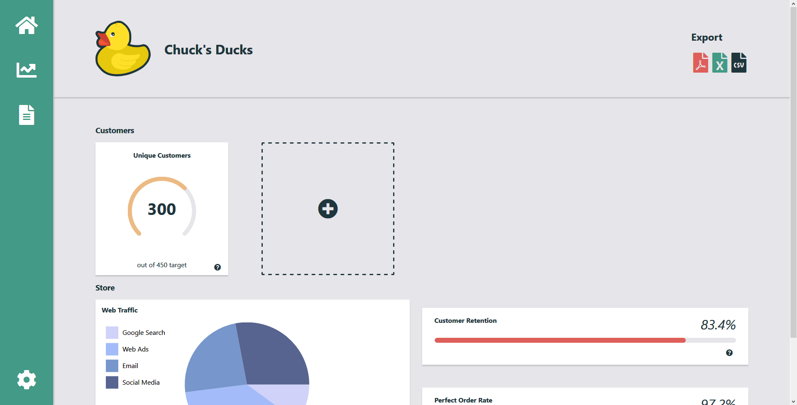
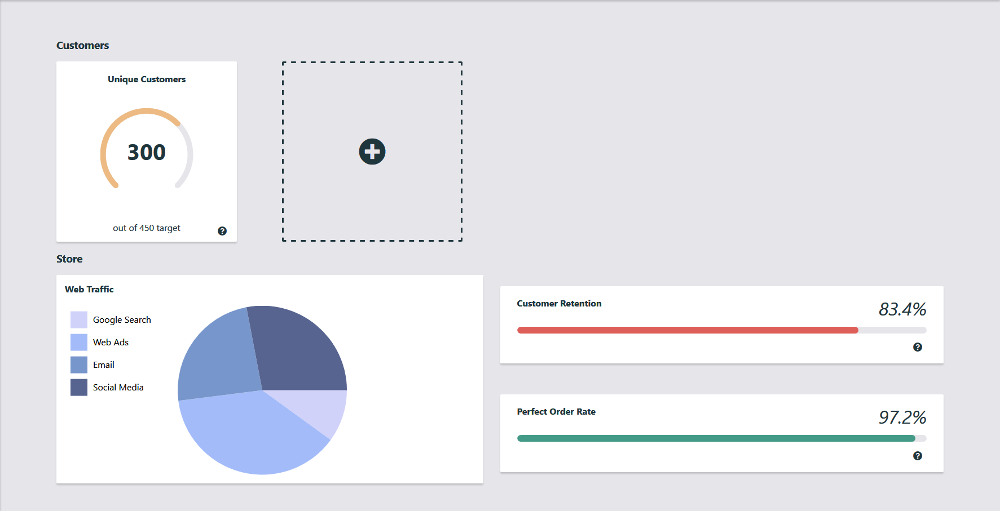

# Chuck's Ducks Data Analytics

Welcome to the Data Analytics platform for Chuck's Ducks! Chuck's Ducks is a family owned rubber duck store. They sell all kinds of rubber ducks; classic yellow ducks, tiny ducks, giant ducks, and even ducks with an improved debugging module. They've been seeing higher web traffic and more sales in recent years and want to bring their data analytics to the web. This is the code that will hopefully take their business to the next level.

## Main Page



## Content Area



The following sections describe the code architecture, project structure, developer tooling, and the assignment.

## The Project "Framework"

This project's goal is to not use a single UI framework or library (React, Angular, Ember, etc).
Because of this, the only way to create and manipulate elements is using the browser provided DOM API.
This "framework" is taken from [this medium post](https://blog.rinatussenov.com/vanilla-javascript-development-in-2018-c076d121e903). For a full explaination, refer to this post.

The main entry point of the "framework" is the App component class. This class defines a `render` method that composes the children for the root element of our app and then appends the children to that element. This is the only place that the application manipulates DOM. Here is an example:

```javascript
class App {
  constructor(root) {
    this._root = root;
  }

  render() {
    const element = document.createElement("p");
    element.innerText = "This is a paragraph";

    this._root.appendChild(element);
  }
}
```

For other components, instead of `render`, they have `getElement`. This method returns the component's element rather than rendering it to the DOM. This is so that `App.render` has full control over DOM interaction.

```javascript
class Paragraph {
  constructor(text) {
    this._text = text;
  }

  getElement() {
    const p = document.createElement("p");
    p.innerText = this._text;

    return p;
  }
}
```

## Project Structure

- `.vscode`: Visual Studio Code configuration files
- `public`: Static files for the application
- `src`: All source code and assests used in the application
  - `assets`: Assests for the application. This includes images and fonts.
  - `components`: Components created in the format described in [The "Framework"](#The-"Framework")
  - `styles`: Styles for components written in CSS

**Note** You can use your editor of choice! This project was built in Visual Studio Code and the .vscode folder was left for convenience if you happen to use that.

## Development

This project uses [webpack](https://webpack.js.org/) for building and bundling this application. It has already been set up so there is no need to modify the configuration (unless you'd like to). For convience, NPM package scripts are provided.

### Scripts

Run these commands from the root of this project in your preferred terminal.

| Command       | Result                                 |
| ------------- | -------------------------------------- |
| npm run start | Starts the development server          |
| npm run build | Runs webpack to bundle the application |

When starting or building the application, the output of webpack goes to the `dist` folder.

### Babel

This project uses [Babel](https://babeljs.io/) to compile non-standard JavaScript syntax to browser compatible code. The configured preset for this project is [@babel/preset-env](https://babeljs.io/docs/en/babel-preset-env).

This also uses [babel-plugin-module-resolver](https://github.com/tleunen/babel-plugin-module-resolver) to be able to import modules relative to the `src` directory.

```javascript
// This imports the file "<project_root>/src/styles/MyStyles.css"
import "styles/MyStyles.css";
```

### Additional Packages

This project is barebones when it comes to packages, but that doesn't mean you can't use additional ones if you want to. Regardless of what code has already been written, feel free to install other packages from NPM.

## Assignment

There is two parts to the assignment.

### 1. Implement your own feature or improvement

For the first part, you can either create a new feature or implement an improvement. For a new feature, this could be page navigation, additional charting or data visualizations, or anything that is not already present in the app. For an improvement, find an existing area of the app that could use an upgrade. This can be a refactor, improving upon an existing feature, or fixing a bug that you found.

### 2. Choose an improvement task from the next section

For the second part, choose **one** of the 4 tasks from the following list.

**Tasks**

- Responsive Layout
  - Modify the overall layout to be able to show all content without horizontal scrolling on smaller viewports
- Better Header
  - Modify the Header component to be fixed to the top of the viewport and allow content to scroll under it.
  - When the user scrolls down the page, the header should shrink in height to allow additional content to show.
- Interactive PieChart
  - Add user interactivity to the PieChart component. This could be like the following:
    - When the user hovers over a key in the legend, highlight the respective pie slice
    - When the user hovers over a pie slice, highlight the respective legend key
- Add Additional Range Cards
  - When the user clicks the AddRangeButton, the application displays a list of data points to choose from
  - When the user clicks their desired data point, the application adds an additional RangeCard to the list under Customers
  - Find the addional data points in `src/data.js`
  
  **Notes**
  - Please ensure to fully comment all code.  Any developer opening your submittion should be able to understand what each section is doing.
  - Please ensure to list any new steps that would need to be taken for us to execute you changes, beyond the current steps already listed.

If there are any questions, please contact us!
